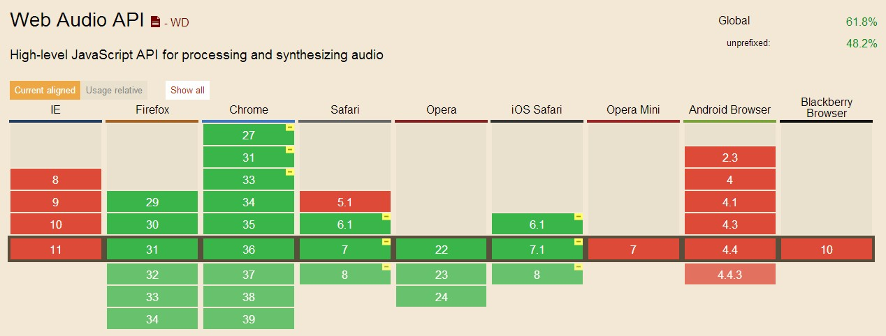

# 移动端音频解决方案

## 音频传输原理

目前音频在互联网上的传输基于流媒体技术, 音频是流媒体的一种, 称其为流媒体是一种形象的比喻, 将数据的传输比作水流, "流"的重要作用体现在可以明显的节省时间, 实现边下载边播放, 而不需要下载完成后才进行播放.

 * 缓存

  流媒体的传输需要缓存, 因为Internet是一个分组交换网, 在其上面传输文件数据都要拆分成一个个数据包, 最后在接收端进行组装, 由于网络是动态变化的, 各个数据包选择的路由可能不尽相同, 故到达客户端的时间延迟也就不等, 先发的数据后到也是常有的事. 因此, 使用缓存来保证到达的数据包进行正确的排序, 从而使媒体数据能连续输出.

  之前提到的边下边播, 也是在缓存中接收到足够的数据时才能进行播放的, 这一点在HTML5的文档中也有所体现.
  
  [ 题外话: HTML5 media 文档中, 提到了两个事件 'canplay' 和 'canplaythrough'. 
  'canplay': '表示浏览器已经加载了足够的数据去播放媒体文件, 但预计以后的播放可能会产生停顿去加载新的数据'
  'canplaythrough': '表示浏览器已经加载了足够的数据去播放媒体文件并且预计在播放中不会产生停顿去加载新的数据' ]

 * UDP

  流媒体传输的实现需要合适的传输协议. 由于TCP需要较多的开销, 因此不太适合传输实时数据. 在流媒体传输的实现方案中一般采用HTTP/TCP来传输控制信息, 使用RTP/UDP来传输实时声音数据.

## 目前可使用的技术

  * Web Audio API

    Web Auido API 是 JavaScript 中用于在网页应用中处理音频的一个高级应该用接口, 主要用于实现Web端的音频处理, 并可以同已存在的其他API相配合, 包括XMLHttpRequest, Canvas 2D 和 WebGL 3D API.

    其支持的功能包括

      * 支持各种类型的音频滤波器以实现各种音频效果, 包括回声, 消除噪音等
      * 支持利用合成声音 (Sound synthesis) 创建电子音乐
      * 支持3D位置音频模拟效果, 比如某种声音随着游戏场景而移动 (3D游戏中应该用处比较大...)
      * 支持外部输入的声音与 WebRTC 进行集成
      * 以及各种高端音频处理方法...

    但是...

    由于移动端对其支持不是很完善 [ iOS已支持, 安卓原生浏览器目前还不支持 ], 目前还是使用支持广泛的 HTML5 Audio 好一些

    

  * HTML5 Audio 标签

    

    Audio 标签是 HTML5 新定义的一个元素, 提供了在 Web 端播放音频的很多功能. 虽然没有 Web Audio API 那么强大, 但足以满足日常音频播放需求, 更重要的是使浏览器原生支持音频播放, 而不依赖 Flash 或 Sliverlight 之类的外部插件


## 移动端音频可能存在的坑及解决方案

  * 编码格式

    audio 元素可以包含多个音频资源, 这些音频资源可以使用 src 属性或者 source 元素来进行描述, 浏览器会选择最适合的一个来使用.

    浏览器不仅要支持 audio 标签而且要支持相应的格式, 并不是所有浏览器都支持相同的音频文件格式.

    目前主有三种主要格式.

      * MP3: MPEG-1 Audio Layer
      * OGG: 一种开放容器格式 (open container format)
      * AAC: 高级音频编码 (Advanced Audio Coding)

  * 属性相关 [ 注: webview 为来往客户端 ]

    * autoplay

      描述: 布尔值, 用来指定音频在加载完成后自动播放. 如果被指定, 即使值为 false, 音频依然会在数据加载到预计可以不停顿的播放到结尾时开始自动播放.

      测试代码:

      ```
        <audio src="test.mp3" autoplay ></audio>
      ```
      测试结果:

      安卓 4.4 webview  页面载入后播放

      安卓 Chrome35     页面载入后不播放 (需用户触发事件, 才会进行播放)

      iOS 7 webview     页面载入后播放

      iOS 7 Safari      页面载入后不播放 (需用户触发事件, 才会进行播放)

      解决方案: 
      AJAX加载, 需 Web Audio API 支持, 可解决安卓移动版Chrome问题, 无需用户触发, 但是解码音频数据需要消耗较长时间. 
      ```
        var audio = document.querySelector('audio');
        var xhr = new XMLHttpRequest();
        xhr.open('GET', audio.src, true);
        xhr.responseType = 'arraybuffer';
        xhr.onload = function() {
          console.log('load [ok]');
          var ctx = new AudioContext();
          ctx.decodeAudioData(xhr.response, function(buffer) {  // 解码音频数据, 较耗时
            if (buffer) { 
              console.log('decode [ok]');
              var source = ctx.createBufferSource();
              source.buffer = buffer;          
              source.connect(ctx.destination);  // 将解码后的数据连接到 destination 节点, 用于播放
              console.log('play start...');
              source.noteOn(0); // 立即播放
            }
          }) 
        }
        xhr.send();
      ```
      对于 iOS Safari 限制比较严格, 比较常见到的做法是在用户第一次 touchstart 时进行事件绑定.

      下面是 howler.js 库针对 iOS 问题的做法
      ```
        _enableiOSAudio: function() {
          var self = this;

          // 已解除限制或非 iOS 设备不执行此函数
          if (ctx && (self._iOSEnabled || !/iPhone|iPad|iPod/i.test(navigator.userAgent))) {
            return;
          }

          self._iOSEnabled = false;

          // touchstart 事件函数
          // 创建并播放一个缓冲区, 然后通过检测音频是否播放来判断 iOS 的音频限制是否解除
          var unlock = function() {
            // iOS 支持 Web Audio API, 创建一个空的缓冲区 (单声道, 1帧, 22050赫兹)
            var buffer = ctx.createBuffer(1, 1, 22050);
            var source = ctx.createBufferSource();
            source.buffer = buffer;
            source.connect(ctx.destination);

            // 播放空缓冲区
            if (typeof source.start === 'undefined') {
              source.noteOn(0);
            } else {
              source.start(0);
            }

            // 在下一个事件循环检测 iOS 限制是否解除
            setTimeout(function() {
              if ((source.playbackState === source.PLAYING_STATE || source.playbackState === source.FINISHED_STATE)) {
                // 限制解除, 更新标志位并且防止 unlock 事件函数再次执行
                self._iOSEnabled = true;
                self.iOSAutoEnable = false;

                // 移除 touchstart 事件函数
                window.removeEventListener('touchstart', unlock, false);
              }
            }, 0);
          };

          // 绑定 touchstart 事件以解除限制
          window.addEventListener('touchstart', unlock, false);

          return self;
        }
      ```

    * buffered [未发现兼容性问题]

      描述: 可以通过该属性获取已缓冲的资源时间段信息.

    * controls [未发现兼容性问题]

      描述: 如果设置了该属性, 浏览器将提供一个包含声音, 播放进度, 播放暂停的控制面板, 让用户可以控制音频播放

      测试代码: 

      ```
        <audio src="test.mp3" controls ></audio>
      ```

      测试结果:

      安卓 4.4 webview  显示控制条

      安卓 Chrome35     显示控制条

      iOS 7 webview     显示播放暂停控制块

      iOS 7 Safari      显示播放暂停控制块

    * loop [未发现兼容性问题]

      描述: 布尔值, 如果指定, 将循环播放音频

      测试代码: 

      ```
        <audio src="test.mp3" loop ></audio>
      ```

      测试结果:

      安卓 4.4 webview  循环播放

      安卓 Chrome35     循环播放

      iOS 7 webview     循环播放

      iOS 7 Safari      循环播放 

    * muted 

      描述: 表示是否静音的布尔值. 默认值为 false, 表示有声音 
     
      注: 更改 muted 值后即时生效.

      安卓 4.4 webview  可读写

      安卓 Chrome35     可读写

      iOS 7 webview     只读

      iOS 7 Safari      只读      

    * played

      描述: 一个 TimeRange 对象, 表示所有已播放的声音片段

    * preload [ none | metadata | auto ]

      描述: 枚举属性, 选择音频预加载方式, autoplay 属性优先于 preload, 即设置了 autoplay 属性后 preload 将不起作用.

        * none: 不进行预加载, 需要播放时进行加载
        * metadata: 不会预加载整个音频, 但对元数据(包括音频长度等音频相关信息)进行预加载
        * auto: 预加载全部音频 [ 空字符串代表 auto ]

      默认: 浏览器自行选择

      测试代码: 

      ```
        <audio src="test.mp3" preload ></audio>
      ``` 
      测试结果:

      移动端除非由用户交互事件触发, 比如 onclick, ontouchstart 触发事件, 否则不会加载音频流.

      解决方案: 

      支持 Web Audio API 可以采用和 autoplay 同样的方法. iOS 设备可以在第一次用户交互时添加事件函数解除限制, 见 autoplay 部分. 

    * src [未发现兼容性问题]

      描述: 用于描述嵌入音频的URL, 也可以在 audio 元素中使用 source 元素来代替该属性指定嵌入的音频

      注: 动态变更 src 地址时, 会暂停之前正在播放的音频, 当再次播放时采用变更后的地址.

    * volume [ 0.0 - 1.0 ]

      描述: 音频播放的音量, 0 为无声, 1 为最大声

      注: 更改 volume 值后即时生效.

      测试结果:

      安卓 4.4 webview  可读写

      安卓 Chrome35     可读写

      iOS 7 webview     只读

      iOS 7 Safari      只读

  * 方法相关

    * canPlayType()

      描述: 给出浏览器是否能播放指定类型的媒体

        * "probably" : 浏览器最核能支持该类型媒体
        * "maybe"    : 浏览器也许支持该类型媒体
        * ""         : 浏览器不支持该类型媒体

    * load()

      描述: 载入指定音频文件

      移动端 load 函数无效, 在需要播放时进行加载

    * pause()

      描述: 暂停音频播放

    * play()

      描述: 播放音频

      安卓 4.4 webview  调用无限制

      安卓 Chrome35     需要在交互事件函数中调用 (如 click, touchstart) 以解除调用限制, 之后的调用无限制

      iOS 7 webview     调用无限制 

      iOS 7 Safari      同 Chrome 表现一致, 需要在交互事件函数中调用 (如 click, touchstart) 以解除调用限制, 之后的调用无限制        

      测试代码: 
      ```
        playCtl.addEventListener('click', function() {
          audio.play();
        }, false);
        stopCtl.addEventListener('click', function() {
          audio.pause();
          audio.currentTime = 0;
        }, false);
        setTimeout(function() {
          // chrome & safari
          // 1. 10s 内不点击 playCtl, 则此函数无效
          // 2. 10s 内点击 playCtl, 后调用stopCtl, 10s 后开始播放 
          // webview
          // 10s 后自动播放
          audio.play();   
        }, 10000);
      ```

    * 无 stop 函数

      可采用 pause 函数 和 currentTime 属性配合的方式实现

      ```
      audio.pause();
      audio.currentTime = 0;
      ```

  * 并行播放 [ 播放第一个音频时, 执行另一个音频播放操作 ]

    测试代码: 
    ```
      ctl1.addEventListener('click', function() {
        audio1.play();
      }, false);

      ctl2.addEventListener('click', function() {
        audio2.play();
      }, false);
    ```

    测试结果:

    安卓 4.4 webview  播放新的音频会暂停之前播放的音频 [ 目前还木有发现较好的解决方案 ]

    安卓 Chrome35     可以同时播放

    iOS 7 webview     可以同时播放

    iOS 7 Safari      可以同时播放   

## PhoneGap (Cordova) 音频播放
  
  详见 [ https://github.com/wangjx9110/document/blob/master/cordova_learing.md ]

## 总结

  加载和并行播放是两个问题稍微多一些的地方, 针对自动加载后播放及其他一些小的兼容性问题推荐使用 howler.js 音频库 (sound.js貌似也很好还没有使用过) , 
  并行播放问题目前还没有发现比较好的解决方法, 大家如果发现写的有什么错误或者有一些好的解决方案的话, 希望可以告诉我, 也欢迎大家一起交流填坑哈.

### 参考文献

[ http://www.ibm.com/developerworks/cn/web/wa-ioshtml5/ ]

[ https://developer.mozilla.org/en-US/docs/Web/HTML/Element/audio ]

[ https://developer.mozilla.org/en-US/docs/Web/API/AudioContext.createBuffer ]
