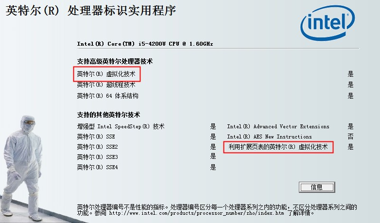
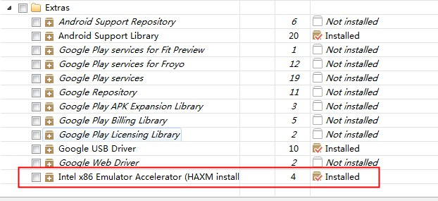
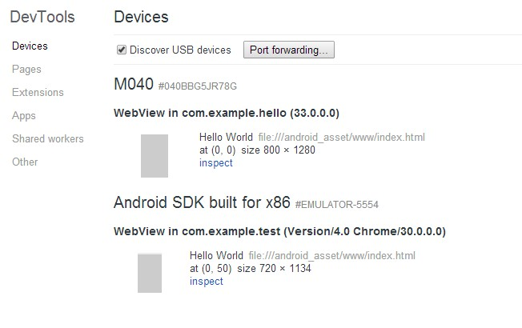
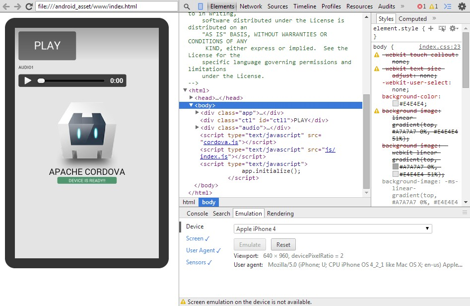

# Cordova (PhoneGap) 探索总结

## 目的
  
  由于在探索 Cordova 的时候遇到了很多坑, 在此做下总结和分享. 大家看到有错误或不好的地方欢迎指正哈.

## 简介

  PhoneGap 是一个用基于 HTML, CSS 和 JavaScript 的, 创建移动跨平台移动应用程序的快速开发平台. 它使开发者能够利用 iPhone, Android, Palm, Symbian, WP7, Bada 和 Blackberry 智能手机的核心功能 —— 包括地理定位, 加速器, 联系人, 声音和振动等, 此外 PhoneGap 拥有丰富的插件, 可以调用.

  Cordova 是贡献给 Apache 后的开源项目, 是从 PhoneGap 中抽出的核心代码, 是驱动 PhoneGap 的核心引擎.

## 环境搭建

  * 相应开发平台的 SDK 包 [ 构建跨平台应用需要对应平台的开发包 ]

    由于目前使用 Windows 系统, 采用 Android SDK 包作为探索.

    Android 开发包需要 Java 作为支持, 所以 Java SDK 的安装也是必须的.

      * Java SDK

        地址: [ http://www.oracle.com/technetwork/java/javase/downloads/jdk7-downloads-1880260.html ]

        环境变量配置: 

        [新增] JAVA_HOME: JDK 安装路径 [ 例: D:\Java\jdk1.8.0_11 ]

        [添加] Path: %JAVA_HOME%\jre\bin; 

        <可用控制台 java 命令验证>
        
        [添加] Path: %JAVA_HOME%\bin;     

        <可用控制台 javac 命令验证>

      * Android SDK

        地址: [ http://developer.android.com/sdk/index.html ]

        环境变量配置:

        [添加] Path: 解压后的 sdk\platform-tools 路径 [ 例: D:\adt-bundle-windows-x86_64-20140702\sdk\platform-tools; ] 

        <可用控制台 adb 命令验证>

        [添加] Path: 解压后的 sdk\tools 路径 [ 例: D:\adt-bundle-windows-x86_64-20140702\sdk\tools; ] 

        <可用控制台 android 命令验证>
        
  * Cordova command-line interface (CLI)

    Cordova 命令行工具, 用于项目新建, 将其构建成不同平台的应用, 并在真实设备或者虚拟机上运行. 它是构建跨平台应用的主要工具.

    * 安装 Cordova

      安装 Cordova 需要 Node.js 和 Git 的支持, 使用如下命令安装
      
      ```
        npm install -g cordova
      ```
        
      注: cordova 的运行也需要 Apache Ant 的支持 [ 构建部分需要, 否则 cordova platform add 部分会报错 ] [ 此部分官网没有提及, 在此作为补充 ]

        地址: [ http://ant.apache.org/bindownload.cgi ]

        环境变量配置: 

        [添加] Path: 解压后的 bin 路径 [ 例: D:\apache-ant-1.9.4\bin; ]

        <可用控制台 ant 命令验证> [ 一般会出现 `Buildfile: build.xml does not exist!` 提示 ]
    
    * 创建项目 [ cordova create ]

      ```
        cordova create hello com.example.hello HelloWorld
      ```
      第一个参数 hello 用于声明项目目录文件名, 当前目录下不应该有重名目录或文件. 生成后的项目目录中的 www子目录用于存储你的应用的主页, 其中包括 css, js 和 img 文件. 项目目录中的 config.xml 文件则描述了对于生成和部署都比较重要的元数据 (metadata).

      第二个参数 com.example.hello 给你的项目提供一个反向域名式的标识符

      第三个参数 HelloWorld 用于描述应用的标题

    * 添加平台 [ cordova platform add ]
      ```
        cd hello  // 需要在项目目录执行
      ```
      ```
        cordova platform add android  // 添加平台
      ```
      ```
        cordova platforms ls // 查看平台状态
      ```
    * 构建项目 [ cordova build ]
    
      ```
        cordova build   // 构建项目
      ```
      ```
        cordova build android   // 构建特定平台项目
      ```
    * 在虚拟机或设备上测试应用

      * 虚拟机
        ```
          cordova emulate android
        ```
        1. 在执行之前, 需要安装对应的虚拟设备, 在控制台中输入 `android` 调出 Andriod SDK Manager, 安装对应的 SDK Platform 和  System Image. [ Cordova 应该有特定 API 需求, 目前是 19 ]

        2. 在 Eclipse 里配置虚拟机 [ Window -> Android Virtual Device Manager 进行配置 ], 配置结束后执行 `cordova emulate android` 命令即可启动虚拟机 <未优化虚拟机会比较卡, 后文介绍加速方式>

      * 真实设备

        ```
          cordova run android
        ```
        1. 在控制台检测连接设备 (测试设备要开启 USB 调试)
          ```
            adb devices
          ```
          用于检测连接设备, 结果如下所示
          ```
            List of devices attached
            [ 设备编号 ]    device
          ```
        2. 如果有连接设备, 执行 `cordova run android` 后, 会在真实设备上运行应用

  * Andriod 虚拟机加速 (Intel 虚化技术)

    直接运行 Andriod 虚拟机会比较卡, 之前想采用 GenyMotion 作为虚拟机, 没有找到方式.
    Cordova 官网介绍了一种开启 Intel 虚化技术来加速 Android 虚拟机的方式.

    * Intel Processor Identification Utility 用于检测当前芯片是否支持虚化技术

      地址: [ https://downloadcenter.intel.com/Detail_Desc.aspx?ProductID=1881&DwnldID=7838 ]

      

      若支持需要在 BIOS 中进行开启 

    * 在 Android SDK Manager 中安装 `Intel x86 Atom System Image` 和  `Intel x86 Emulator Accelerator (HAXM)`

      注: 点击 'Install Package' 后 `Intel x86 Emulator Accelerator (HAXM)` 只是下载完成, 并未进行安装. 需找到下载文件并进行安装, 不同机型可能不同, 安装后虚拟机速度会快不少. 
      [ 我这边是 Andriod SDK 安装目录的 'sdk\extras\intel\Hardware_Accelerated_Execution_Manager' 文件夹下的 'intelhaxm.exe' 文件 ]

      

      

  * Chrome WebView 调试

    无论是虚拟机或真实设备都可以通过 Chrome 进行 WebView 的调试, 在 Chrome 中打开 '工具 -> 检查设备' 即可对特定设备的 WebView 进行调试.

    

    


## 音频组件

  Cordova 大部分硬件事件的支持采用插件的形式提供, 比如 电量信息, 摄像头, 设备移动等

  详细介绍: [ http://cordova.apache.org/docs/en/3.5.0/cordova_plugins_pluginapis.md.html#Plugin%20APIs ]

  如果需要应用支持音频播放, 需要安装 org.apache.cordova.media 插件

  官方提供的安装方式为 `cordova plugin add org.apache.cordova.media` 网络环境不好可能会下载不下来, 可以换用 `cordova plugin add https://git-wip-us.apache.org/repos/asf/cordova-plugin-media.git`

  创建音频对象
  ```
    var media = new Media(src, mediaSuccess, [mediaError], [mediaStatus]);
  ```
  参数

    * src 音频 URI
    * mediaSuccess 成功的回调函数
    * mediaError 错误的回调函数
    * mediaStatus 音频对象状态改变时触发的回调函数, 状态值会作为参数传递给回调函数

  常量

    作为传递给 mediaStatus 回调函数的参数

      * Media.MEDIA_NONE = 0;
      * Media.MEDIA_STARTING = 1;
      * Media.MEDIA_RUNNING = 2;
      * Media.MEDIA_PAUSED = 3;
      * Media.MEDIA_STOPPED = 4;

  方法

    * media.getCurrentPosition: 返回音频文件的当前播放位置
    * media.getDuration: 返回音频文件的持续时间
    * media.play: 播放或恢复一个音频文件
    * media.pause: 暂停音频文件的播放
    * media.release: 释放操作系统底层的音频资源
    * media.seekTo: 移动一个音频文件的当前位置
    * media.setVolume: 设置音量大小
    * media.stop: 停止音频播放

  官方文档: [ https://github.com/apache/cordova-plugin-media/blob/master/doc/index.md ]

### 参考文献

  [ http://baike.baidu.com/view/4157600.htm ]

  [ http://cordova.apache.org/docs/en/3.5.0/ ]

  [ http://stackoverflow.com/questions/17688030/html5-audio-on-apache-cordova-android-native-app ]


